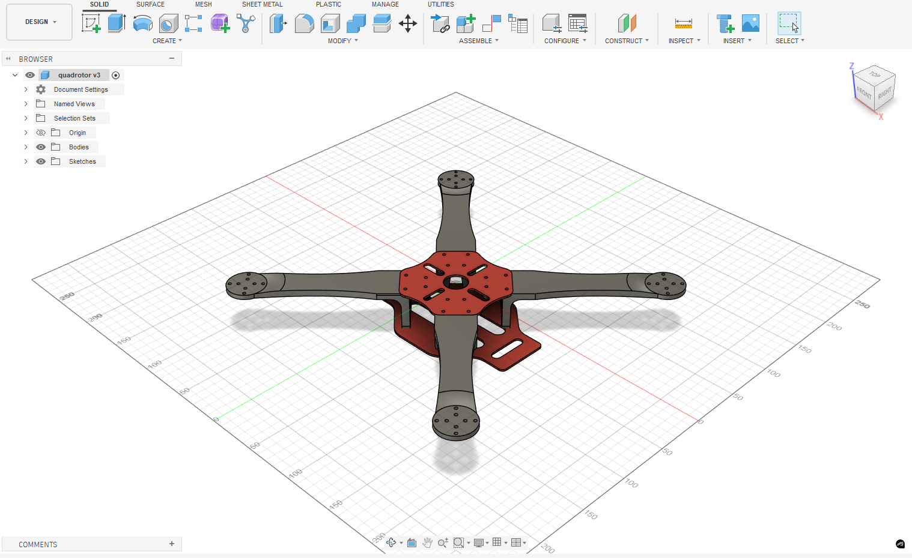
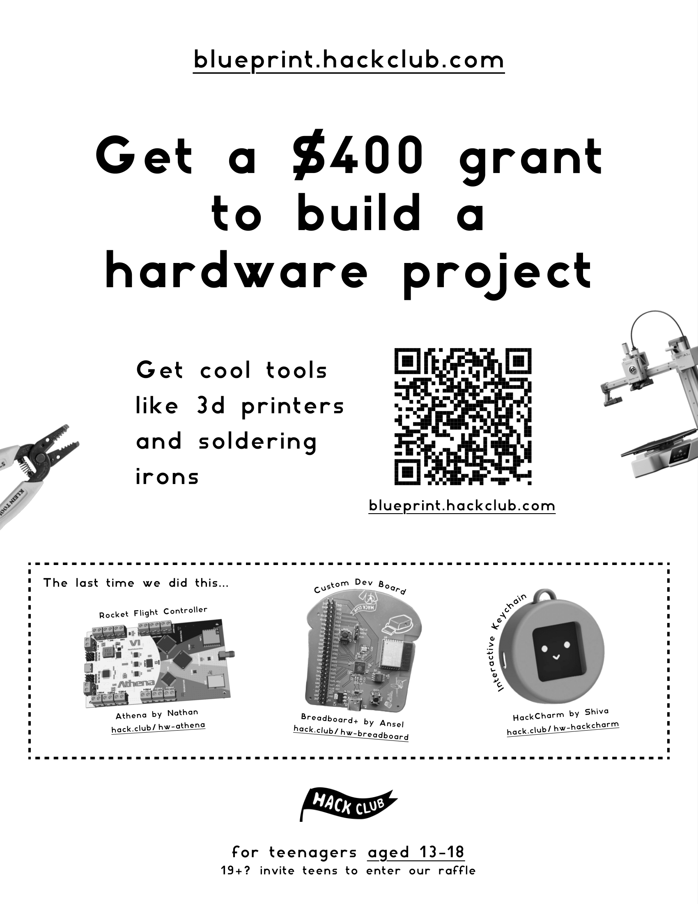

# Long-Endurance UAV Control Systems

This repo is my personal engineering journal and experiment log for a long-term UAV (drone) project. I’m documenting everything from control systems to power efficiency, starting slow and safe before anything flies.

This is not a “buy parts and fly” project. It’s more about learning how things actually work under the hood.

---

## Why I’m doing this

I’ve always been curious about how drones respond to human input. Like:

- How does moving a stick turn into a signal?
- What happens when the signal is lost?
- How do flight controllers decide what’s safe?
- Why do some drones fly longer than others?

Instead of guessing or copying builds, I want to learn properly by experimenting, breaking things (safely), and writing everything down.

---

## How this project is structured

I’m approaching this in stages so I don’t rush or do anything unsafe.

### Stage 1: Control systems (no flying)

This stage is fully ground-based.

I’ll be using:

- An RC transmitter  
- A receiver  
- A PC  

Here’s what I’ll learn:

- How RC protocols work (e.g. iBUS)
- Channel mapping and calibration
- Failsafe behavior
- How input turns into data
- Latency and signal stability

No motors. No props. Just signals and learning.

---

### Stage 2: Flight controller logic

Once I understand receiver signals, I’ll move on to a flight controller.

Goals:

- How flight controllers interpret RC input
- Arming logic and safety checks
- Configuration using Betaflight
- Understanding what actually happens before motors spin

Still focused on safety and testing, not flying.

---

### Stage 3: Power systems & endurance (future)

This is the long-term goal.

Topics I’ll explore:

- Battery types (LiPo vs Li-ion)
- Voltage vs current tradeoffs
- Efficiency vs weight
- Why some setups achieve longer flight times

Everything will be tested carefully and documented.

---

## CAD Design

The image below shows the current quadrotor frame design developed in Fusion 360.  
This CAD represents the mechanical structure and will continue to evolve as testing progresses.

---

## Electronics (Phase 1 – TX/RX Testing)

The current phase focuses on validating transmitter–receiver communication before integrating propulsion or flight electronics. Electrical components for later stages will be added as the project progresses.

---

## Safety first (always)

Safety is a priority throughout this project:

- No powered flight during early stages
- Batteries charged only with balance chargers
- Anti-spark connectors for high-power setups
- Fire-safe charging environment

If something feels unsafe, it doesn’t happen.

---

## Blueprint Hack Club

This project is being developed as part of **Blueprint by Hack Club**, a program that supports students building real, self-directed engineering projects.

If you’re interested in joining Blueprint, you can check it out using my referral link:

👉 **https://blueprint.hackclub.com/r/8580?ref=r**

You can also join this by the poster below:

---

## Documentation style

This repo is meant to be honest and real:

- I’ll log mistakes and failures
- I’ll write in simple language
- I’ll include diagrams, notes, and configurations
- Progress is more important than perfection

If someone else learns from this later, that’s a bonus.

---

## Current status

Just getting started.

Next steps:

- Set up transmitter and receiver
- Interface receiver with PC
- Start logging control signal experiments

---

## License

This project is licensed under the MIT License. See the LICENSE file for details.
